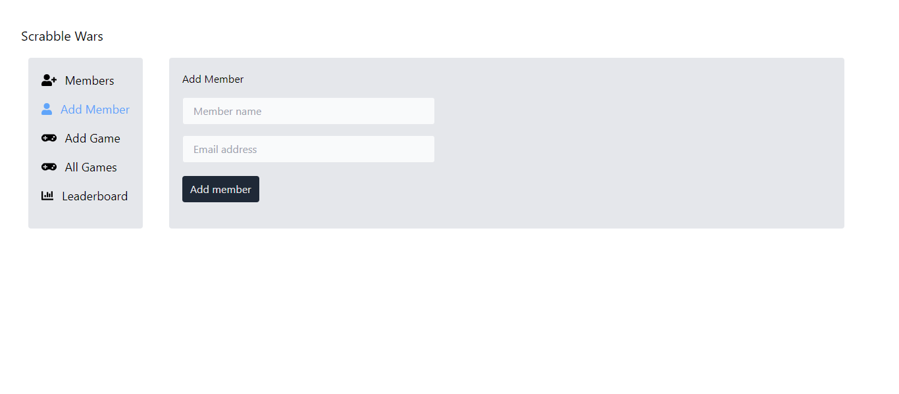
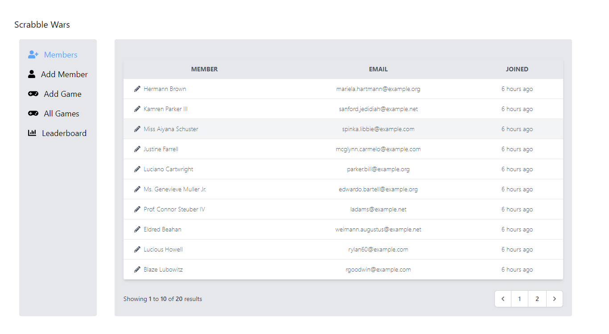
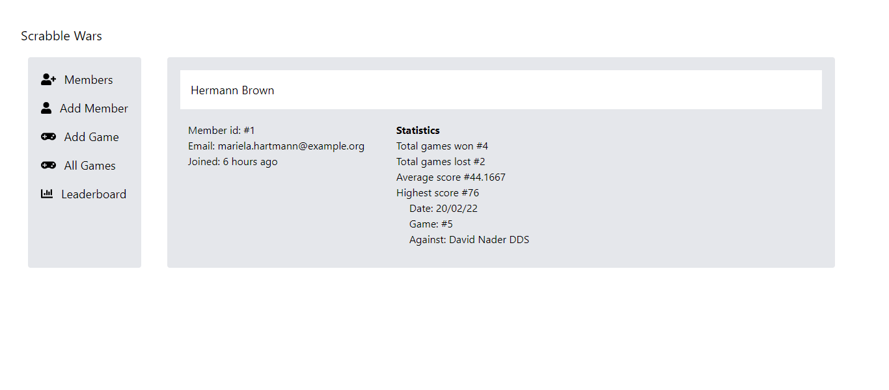
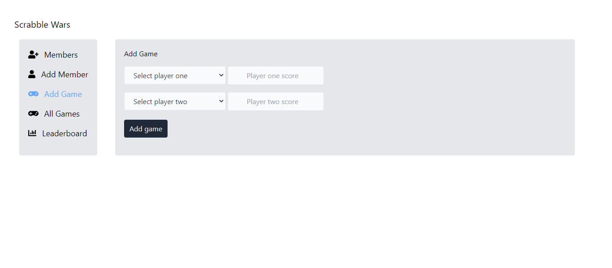
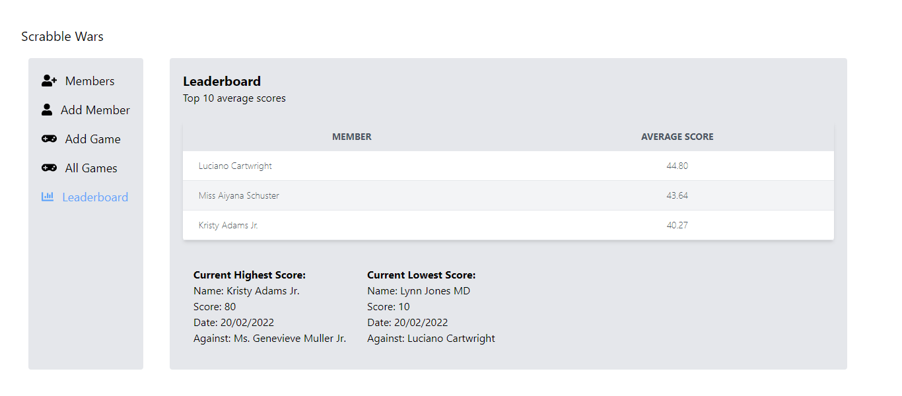

## Scrabble Wars Coding Challenge

### Description
A Scrabble Club requires a system to store members’ information and provide leader boards to show their top performing players.
For the basic details of members, the requirement is to store information such as the date they joined the Club, and their contact details. All recorded Scrabble games are head-to-head matches between two players: the player with the higher score at the end of the game wins.
- A members’ page including the following
  - Option to add a new member
  - Option to edit a member to update a members’ details.
  - Option to view a member’s profile screen
- A members’ profile screen showing
  - number of wins. Cnt where winners = 1
  - number of losses. Cnt where winners = 0
  - their average score. Avg(scrore)
  - their highest score, when and where it was scored, and against whom. Max(score)
- The ability to add scores for matches to the database.
- A leader board screen to list the members with the top 10 average scores, drawn only from those members who have played at least 10 matches.
- Below the leader board, statistics showing the current highest and lowest scores achieved, who scored them, against whom, and when.

### Stack
- PHP
- Laravel
- Blade

### Installation

- php artisan migrate
- php artisan db:seed
- php artisan serve

### Screenshots

